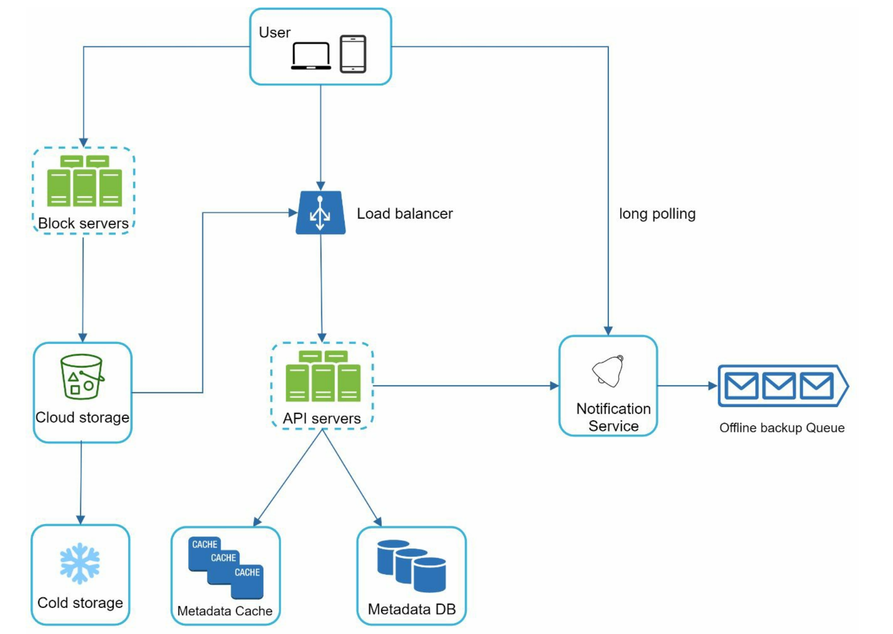

这张架构图展示了一个非常经典的、**控制面（Control Plane）与数据面（Data Plane）分离**的大型分布式文件存储系统设计。这正是设计 Google Drive、Dropbox 或 OneDrive 的核心架构思路。

### 1. 核心组件深度解析

我们可以将图中的组件分为三类：**客户端**、**元数据/控制层**、**存储/数据层**。

#### A. 客户端 (User Devices)
*   **角色：** 笔记本、手机等终端设备。
*   **隐藏逻辑（图未画出但必须存在）：** 客户端不仅仅是发请求，它包含复杂的逻辑：
    *   **Chunking（分块）：** 将大文件切分成小块。
    *   **Hashing（哈希）：** 计算块的哈希值用于去重。
    *   **Watcher（监听器）：** 监控本地文件系统的变化，触发同步。

#### B. 数据层 (The Data Plane)
这是处理“重”数据的部分，流量大、带宽消耗高。

1.  **Block Servers (块服务器集群):**
    *   **功能：** 专门处理文件块（Block）的上传和下载。
    *   **为什么独立？** 上传下载非常消耗带宽和连接时间。如果让 API Server 处理文件流，会迅速耗尽 CPU 和内存，阻塞元数据请求。将其独立出来，可以单独扩容。
    *   **工作模式：** 客户端通常先找 API Server 拿“令牌”或“预签名 URL”，然后直接把数据传给 Block Server。
2.  **Cloud Storage (云存储 / S3):**
    *   **功能：** 实际的物理存储（如 AWS S3, Google GCS）。
    *   **特性：** 提供高持久性（Durability）。Block Server 将接收到的块写入这里。
3.  **Cold Storage (冷存储 / Glacier):**
    *   **功能：** 存储不常访问的数据。
    *   **策略：** 对于很久没打开的旧文件，自动从 Cloud Storage 迁移到 Cold Storage，以**降低成本**（冷存储价格通常是热存储的 1/10）。

#### C. 控制层 (The Control Plane)
这是系统的“大脑”，处理逻辑、权限和状态。

1.  **Load Balancer (负载均衡器):**
    *   **功能：** 将流量分发到健康的 API Server 节点，处理 SSL 卸载。
2.  **API Servers (API 服务集群):**
    *   **功能：** 无状态服务。处理登录、列出文件目录、重命名、移动文件、权限检查等请求。
    *   **交互：** 它不处理文件内容，只读写元数据数据库。
3.  **Metadata DB (元数据数据库):**
    *   **功能：** 存储文件树结构、Owner、权限、版本信息、Block 与文件的映射关系。
    *   **关键点：** 这里需要**强一致性**（ACID），通常使用分库分表的 MySQL 或 NewSQL（如 CockroachDB/TiDB）。
4.  **Metadata Cache (元数据缓存):**
    *   **功能：** 缓存热点元数据（如根目录列表、用户信息）。
    *   **技术：** Redis 或 Memcached。这是降低 DB 压力、提升响应速度的关键。
5.  **Notification Service (通知服务):**
    *   **功能：** 实时推送变更。
    *   **连接方式：** 图中标注了 **Long Polling (长轮询)**。这是网盘类应用的标准做法。相比 WebSocket，长轮询在维护海量空闲连接时对服务器资源消耗更可控。
6.  **Offline Backup Queue (离线备份队列/消息队列):**
    *   **解读：** 这个名字起得稍微有点歧义，更准确的理解应该是 **Message Queue (消息队列，如 Kafka)**。
    *   **作用：** 解耦。当 API Server 更新了元数据后，将变更事件写入队列。Notification Service 消费这个队列，然后推送给用户。
    *   **"Offline Backup"的含义：** 可能指如果用户不在线，消息会堆积在这里，等用户上线后再拉取；或者用于触发后台的异步任务（如搜索索引构建、病毒扫描）。

---

### 2. 核心数据流转分析 (Data Flow)

#### 场景一：文件上传 (Upload)
1.  **元数据请求：** User -> LB -> API Server。告诉服务器“我要上传一个文件，Hash 是 XYZ”。
2.  **去重检查：** API Server 查询 Metadata DB。如果 Hash 已存在，直接“秒传”成功（仅更新元数据）。
3.  **数据传输：** 如果是新文件，API Server 返回上传地址。User -> Block Servers。客户端将文件块直接传给 Block Server。
4.  **落盘：** Block Server -> Cloud Storage。
5.  **完成通知：** 上传完成后，Block Server 通知 API Server 更新状态为“可用”。

#### 场景二：文件同步 (Sync / Notification)
1.  **变更发生：** 用户 A 上传了新文件，API Server 更新 DB。
2.  **发布事件：** API Server 将“文件更新”事件写入 **Offline Backup Queue (Message Queue)**。
3.  **消费与推送：** Notification Service 消费消息，发现该文件属于共享文件夹，用户 B 也关注这个文件夹。
4.  **实时通知：** Notification Service 通过 **Long Polling** 通道，立刻告诉用户 B：“有新文件，快来拉取”。
5.  **拉取元数据：** 用户 B 向 API Server 请求最新的元数据列表。

---

### 3. 架构亮点分析 (Expert Review)

作为面试者，我会这样评价这个架构：

1.  **读写分离与动静分离：**
    *   将 Block Server (数据流) 与 API Server (控制流) 彻底剥离。这是处理大文件传输系统的**铁律**。防止上传大文件占用 API 线程。
2.  **多级存储策略 (Tiered Storage):**
    *   引入 Cold Storage 是非常务实的成本优化设计。网盘中 80% 的数据可能一年都不会被访问一次，没必要存在昂贵的 S3 标准层。
3.  **异步解耦：**
    *   Notification Service 配合 Queue 的设计，保证了 API Server 的低延迟。API Server 不需要同步等待推送结果，只需把事件扔进队列即可返回。

---

### 4. 潜在问题与优化方向 (Deep Dive)

如果面试官问：“这个架构有什么可以改进的？” 我会指出以下几点：

1.  **Block Server 的单点/性能瓶颈：**
    *   图中 Block Server 似乎是自建的代理层。其实，现代架构通常利用 **Cloud Storage 的 Pre-signed URL (预签名 URL)** 功能，让客户端**直接**上传到 S3/GCS，完全绕过 Block Server。这能极大地节省流量成本和运维成本。
2.  **Metadata DB 的扩展性：**
    *   随着文件数量达到十亿级，单机 DB 必死。图中画的是简单的 DB 图标。实际上这里必须实施 **Sharding (分片)** 策略，通常基于 `user_id` 进行分片，或者使用分布式数据库。
3.  **本地缓存 (Client-side Cache)：**
    *   图中未体现客户端的本地数据库（如 SQLite）。优秀的网盘客户端会在本地维护一份元数据索引，减少对 API Server 的 `List` 请求，只在收到 Notification 时请求增量变更。
4.  **流量削峰：**
    *   Notification Service 指向 Queue 的箭头方向似乎反了，或者标注有误。通常是 API Server -> Queue -> Notification Service。如果是 Notification Service -> Queue，那可能是为了做“离线消息存储”。

### 总结

这张图是一个非常标准的**企业级网盘架构蓝图**。它正确地识别了网盘系统的核心难点：**元数据管理**与**海量数据存储**的矛盾，并通过拆分服务、引入缓存和队列来解决。理解这张图，就理解了 Dropbox/Google Drive 的核心骨架。