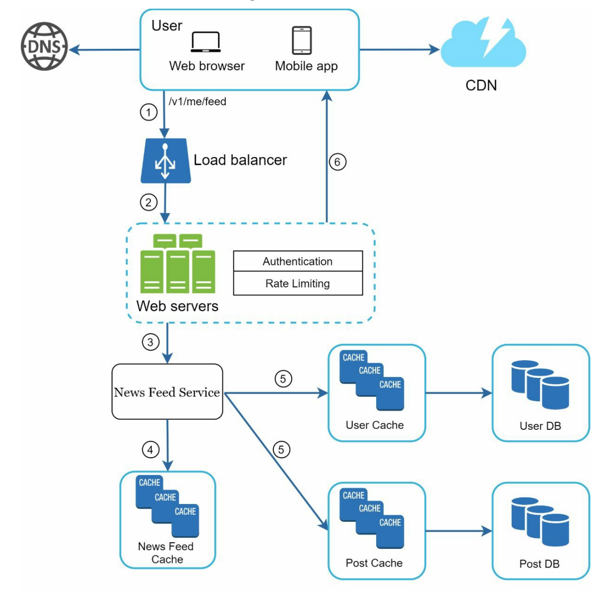

这是同一个系统的另一面。上一张图展示的是“写流程”（发布帖子），而这张图展示的是**“读流程”（News Feed Retrieval / 获取信息流）**。

这张架构图描绘了当用户打开App或刷新页面时，系统是如何迅速把“朋友圈/时间线”的数据组装并返回给用户的。

以下是对该架构图的详细流程解释和技术分析：

------

### 一、 核心流程详解 (Step-by-Step Read Flow)

流程始于用户的“刷新”动作，终于客户端渲染出图文并茂的列表。

#### 1. 接入与路由 (Steps 1 & 2)

- **Request:** 用户发送请求 `GET /v1/me/feed`。
- **CDN (Content Delivery Network):** 图右上角出现了 CDN。**注意**：通常 API 请求（如获取Feed列表 JSON 数据）不会走 CDN，因为它是高度动态和个性化的。CDN 在这里的作用是缓存Feed流中的**静态资源**（如图片、视频、头像）。
- **Load Balancer:** 将请求分发到 Web Servers。

#### 2. 业务处理 (Step 3)

- **Web Servers:** 执行身份认证和限流后，将请求转发给核心服务 —— **News Feed Service**。
- **News Feed Service:** 这是“读流程”的指挥官（Aggregator）。它的任务不是生产数据，而是**组装数据**。

#### 3. 获取 ID 列表 (Step 4 - The Skeleton)

- **News Feed Cache:** Service 首先去查询这个缓存。
- **关键点:** 这里存储的通常**不是**完整的帖子内容，而是一个 **Post ID 的列表**（例如：`[105, 103, 99, ...]`）。
- **来源:** 这个列表正是由上一张图中的“Fanout Workers”在写入流程中提前推送到这里的。
- **为什么要存 ID？** 能够极大地节省内存，并且在这个阶段，系统只需要知道“该给用户看哪些帖子”。

#### 4. 数据“水合” (Step 5 - The Hydration)

拿到一堆 ID 之后，客户端无法直接显示，Service 需要把这些“骨架”填充上“血肉”。这个过程被称为 **Hydration (水合/组装)**。

News Feed Service 会**并发**地（Parallel Fetching）查询两个主要的数据源：

- **A. Post Cache / Post DB:**
  - 根据 Post ID 获取帖子的文本内容、图片URL、发布时间等。
- **B. User Cache / User DB:**
  - 根据帖子中的 Author ID，获取发布者的头像、昵称等信息。

> **技术细节 (Multiget):** 这一步通常是非常密集的读操作。为了性能，Service 会使用 `Multiget` 模式一次性从 Redis 拉取 20 条帖子的内容，而不是循环 20 次去请求。

#### 5. 返回响应 (Step 6)

- News Feed Service 将组装好的完整 JSON 对象（包含帖子内容+用户信息）返回给 Web Servers，最终返回给客户端。
- 客户端收到 JSON 后，解析其中的图片 URL，再向 CDN 请求具体的图片资源进行渲染。

------

### 二、 架构深度分析

#### 1. 读写分离与缓存策略

这张图非常清晰地展示了**“ID 与 内容分离”**的缓存策略：

- **News Feed Cache:** 存结构（关系）。它是**每个用户独一份**的（User A 的时间线）。
- **Post Cache / User Cache:** 存实体（内容）。它是**全局共享**的。
- **优势:**
  - **存储效率:** 如果一个大V发的帖子被 100 万人看到了，我们不需要在 100 万人的 Feed Cache 里都存一份帖子内容，只需要存 100 万个 Post ID。内容只在 Post Cache 里存一份。
  - **数据一致性:** 如果用户修改了头像，或者编辑了帖子内容，只需要更新 `User Cache` 或 `Post Cache` 这一处。所有引用该 ID 的 Feed 流在下次刷新时，自动就能拉取到最新内容。

#### 2. 数据库的回源 (Cache Miss)

图中箭头同时指向了 Cache 和 DB（例如 Post Cache -> Post DB）。这暗示了标准的 **Look-aside Cache（旁路缓存）** 模式：

- Service 先读 Cache。
- 如果 Cache 没数据 (Miss)，则去读 DB。
- 读到数据后，返回给 Service 并回填到 Cache 中。

#### 3. 性能瓶颈与优化 (Scatter-Gather)

在 Step 5 中，系统执行的是 **Scatter-Gather (分散-收集)** 模式。

- **挑战:** 如果一个用户的 Feed 页有 20 条帖子，涉及 15 个不同的作者。如果不做优化，可能需要串行查询多次缓存/数据库，延迟会线性叠加。
- **Go 语言应用场景:** 结合您感兴趣的 Go 语言，这正是 `goroutine` 和 `errgroup` 大显身手的地方。可以在 News Feed Service 中启动多个 goroutine 并发地去 User Cache 和 Post Cache 拉取数据，最后聚合结果，将延迟降低到最慢的那一次请求的时间（Long tail latency）。

------

### 三、 总结：从写到读的闭环

结合您提供的两张图，我们可以看到一个完整的现代社交网络架构：

1. **写流程 (上一张图):** 重在**“扩散”**。通过 MQ 异步处理，将 Post ID “推”送到所有粉丝的 `News Feed Cache` 中。
2. **读流程 (这张图):** 重在**“聚合”**。从 `News Feed Cache` 拿 ID，再从全局缓存中“拉”取详情，组装返回。

对比思考:

如果是“拉模式”（Pull Model），Step 4 就不会是去查 News Feed Cache，而是直接去查“关注列表” + “好友的所有帖子表”并在内存中实时排序。这张图明确画出了 News Feed Cache，说明它主要依赖的是**“推模式”**（或推拉结合）。