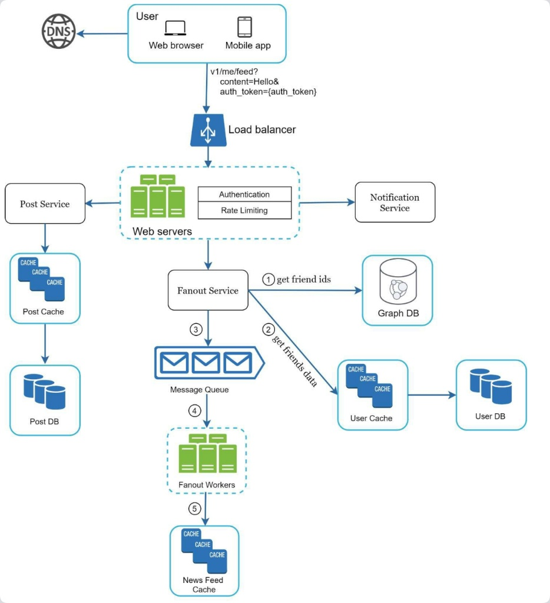

这是一个非常经典的**社交网络“Feed流”（News Feed）系统的架构设计图**，具体来说，展示的是**“发布帖子”（Write Flow）并将其推送给好友**的流程。

这种架构常见于像微博、Twitter、Facebook或微信朋友圈的早期设计中。

以下是对该架构图的详细流程解释和技术分析：

------

### 一、 核心流程详解 (Step-by-Step Flow)

整个流程始于用户在客户端的一个操作（发布一条内容），终于该内容出现在其好友的时间线（News Feed）缓存中。

#### 1. 接入层 (Gateway Layer)

- **User (Client):** 用户通过浏览器或App发起请求。请求是一个HTTP POST请求，例如 `v1/me/feed`，携带了内容 `content=Hello` 和认证令牌 `auth_token`。
- **DNS:** 解析域名，指向最近的数据中心IP。
- **Load Balancer (负载均衡器):** 接收流量，并将其分发到后端的 Web 服务器集群，保证高可用和负载均衡。

#### 2. 业务逻辑层 (Web Servers)

- **Web Servers:** 这是处理请求的入口应用服务。
  - **Authentication (认证):** 验证 `auth_token`，确保用户身份合法。
  - **Rate Limiting (限流):** 防止恶意刷接口或过载，保护后端服务。
  - 一旦通过检查，Web Server 会协调三个主要服务：
    1. **Post Service (帖子服务):** 处理帖子内容的存储。
    2. **Notification Service (通知服务):** (图中分支) 可能用于给被@的用户或特定关注者发送推送通知。
    3. **Fanout Service (分发服务):** (核心路径) 负责将帖子分发给粉丝/好友。

#### 3. 帖子存储 (Post Persistence)

- **Post Service:**
  - **Post Cache:** 首先将新帖子写入缓存（如Redis），通过 `write-through` 或 `write-back` 策略。
  - **Post DB:** 将帖子数据持久化到数据库（如MySQL或Cassandra），这是数据的权威源（Source of Truth）。

#### 4. 分发流程 (Fanout Workflow - 图中核心数字步骤)

这是整个架构中最关键的部分，采用了**“推模式”（Push Model / Fanout-on-Write）**。

- **Fanout Service:** 接收到“新帖子已发布”的信号。
  - **① Get friend ids:** 查询 **Graph DB**（图数据库，如Neo4j）。这是为了找出“谁关注了当前用户”或“谁是当前用户的好友”。
  - **② Get friends data:** 查询 **User Cache/User DB**。获取好友的一些元数据（比如好友是否屏蔽了该用户，或者好友的偏好设置），用于过滤。
- **③ Message Queue (消息队列):**
  - Fanout Service 将计算好的“分发任务”发送到 **Message Queue**（如Kafka或RabbitMQ）。
  - **作用:** **解耦**和**削峰填谷**。如果用户有几千个好友，同步写入数据库会很慢，使用MQ可以异步处理。
- **④ Fanout Workers:**
  - 这是一组消费者服务，从MQ中拉取任务。
- **⑤ Update News Feed Cache:**
  - Worker 将新帖子的ID（通常只是ID，不包含完整内容）插入到每一个好友的 **News Feed Cache**（通常是Redis的List结构或ZSet结构）中。

------

### 二、 关键组件分析

1. **Graph DB (图数据库):**
   - 这是处理社交关系的最佳选择。查询“谁关注了我”或“我是谁的朋友”在关系型数据库中需要复杂的Join操作，而在图数据库中非常高效。
2. **Message Queue (消息队列):**
   - 这是高并发写入的关键。没有MQ，当用户发布帖子时，系统必须同步等待所有好友的缓存更新完毕才能返回成功，这会导致极高的延迟。MQ让这个过程变成异步的。
3. **Cache 分层 (Post Cache vs. News Feed Cache):**
   - **Post Cache:** 存的是具体的帖子内容（文本、图片URL）。
   - **News Feed Cache:** 存的是**ID列表**（例如：UserA的Feed = [PostID_100, PostID_99...]）。
   - **读取时的逻辑:** 当好友刷新朋友圈时，先从 News Feed Cache 拿到 ID 列表，再根据 ID 去 Post Cache 批量拉取具体内容（这种模式称为“ID拉取模型”）。

------

### 三、 架构模式分析：推模式 (Push Model)

这个架构图典型地展示了 **Fanout-on-Write（写扩散/推模式）**。

- **原理:** 用户发帖时，系统主动把帖子“推”给所有粉丝的收件箱（Cache）。
- **优点:**
  - **读操作极快:** 用户刷新朋友圈时，数据已经准备好了，直接读缓存即可，不需要复杂的数据库查询聚合。
  - 适合好友数量适中（如微信朋友圈、双向关注的社交网络）的场景。
- **缺点:**
  - **写操作重:** 发一条帖子需要写N次缓存（N=粉丝数）。
  - **“惊群效应” (The Celebrity Problem):** 如果一个大V（如马斯克）有1亿粉丝，发一条推文需要往1亿个用户的缓存里写数据，会导致MQ拥堵和缓存集群压力过大，产生巨大的延迟。

### 四、 总结与优化建议

**图示架构的优点:**

1. **清晰的分层:** 接入、业务、存储、异步处理分层明确。
2. **高性能读取:** 牺牲写入性能（通过MQ缓解），换取了极致的读取性能（推模式）。
3. **扩展性:** 各个组件（Web Server, Workers, Caches）都可以独立水平扩展。

**潜在瓶颈/缺失:**

1. **大V问题:** 正如上面所说，对于拥有百万级粉丝的用户，单纯的“推模式”会失效。
   - *优化方案:* 通常采用**混合模式 (Hybrid Approach)**。普通用户用“推模式”；大V用户用“拉模式”（发帖时不推送，粉丝读取时临时去拉取大V的帖子并聚合）。
2. **媒体资源处理:** 图中只展示了文本/元数据的流向。通常还需要一个对象存储（如S3/OSS）和CDN来处理图片和视频。