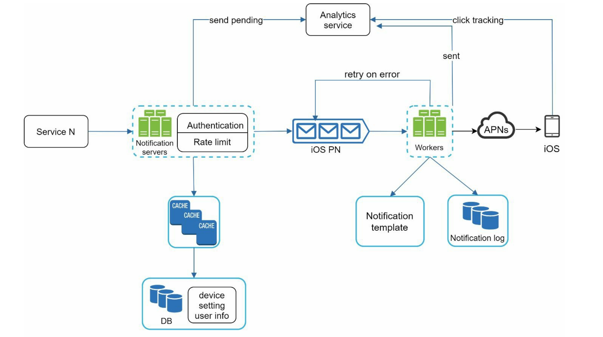

这张图展示了一个典型的、生产级**分布式通知系统（Notification System）**的架构流程，专门针对 **iOS 推送（APNs）** 的场景。

这是一个非常标准且设计精良的架构，涵盖了从业务触发到用户接收，再到数据分析的完整闭环。

以下是对该架构的详细拆解与分析：

### 1. 核心流程拆解（从左至右）

整个流程可以分为三个阶段：**触发与校验**、**缓冲与处理**、**发送与反馈**。

#### **阶段一：触发与校验 (Entry & Validation)**

- **Service N (业务服务):** 这是通知的源头（如订单服务、聊天服务）。它们不直接发通知，而是调用统一的接口。
- **Notification Servers (网关层):**
  - **Authentication (认证):** 防止非法调用，确保只有内部受信任的服务能发通知。
  - **Rate Limit (限流):** 这是一个自我保护机制。如果某个业务服务 bug 导致疯狂调用接口，Rate Limit 会拦截请求，防止下游被打挂。
- **User Info & Device Settings (元数据加载):**
  - 在发送前，Server 需要知道发给谁（Device Token）以及用户是否允许发送（Settings）。
  - **Cache & DB:** 这是一个典型的读写分离或缓存优先策略。由于通知通常是高并发的，直接查 DB 会死锁或超时，所以先查 Cache（如 Redis），Cache 未命中再查 DB。

#### **阶段二：缓冲与处理 (Buffering & Processing)**

- **iOS PN (Message Queue/消息队列):**
  - 这是架构的核心组件（图中信封图标处）。
  - **作用：** **解耦**和**削峰填谷**。如果“双11”瞬间来了 100 万条通知，Workers 处理不过来，消息会先堆积在队列里，而不是把服务器压垮。
- **Workers (消费者服务):**
  - 这是一组服务器集群，负责从队列里取消息并执行真正的发送逻辑。
  - **Notification Template (模板服务):** Workers 不直接硬编码文案，而是去取模板（例如：“您好 {user}, 您的订单 {id} 已发货”），填充参数生成最终 payload。
  - **Notification Log (日志):** 记录发送历史，用于排查问题或审计（“用户说没收到，查查看我们发没发”）。

#### **阶段三：发送与反馈 (Delivery & Feedback)**

- **APNs (Apple Push Notification service):** iOS 的官方推送网关。Worker 将构建好的 payload 发给苹果服务器。
- **Retry on error (重试机制):**
  - 注意那条回头的箭头。如果 Worker 发给 APNs 失败（网络抖动或 APNs 报错），消息会被扔回队列（或重试队列）等待再次消费。**这正是导致“无法精准一次”的物理原因之一。**
- **Analytics Service (数据分析):**
  - 系统收集了三个维度的数据：
    1. **Send Pending:** 刚进系统（Server端）。
    2. **Sent:** 发送成功（Worker端）。
    3. **Click Tracking:** 用户点击（客户端回传）。
  - 这构成了**漏斗分析**，用于监控通知的到达率和转化率。

------

### 2. 架构亮点分析

这张图体现了几个关键的分布式系统设计原则：

#### **A. 解耦与异步 (Decoupling & Async)**

通过 **Message Queue (iOS PN)** 将“接收请求”和“发送请求”隔离开。

- **好处：** 前端业务服务（Service N）发完请求就可以立即返回，不需要等待漫长的 APNs 响应，提升了主业务的响应速度。

#### **B. 稳定性设计 (Stability)**

- **限流 (Rate Limit):** 保护系统不被突发流量冲垮。
- **缓存 (Cache):** 减少数据库压力，降低延迟。
- **重试 (Retry):** 保证了 **At-Least-Once**（至少送达一次）的可靠性。

#### **C. 可扩展性 (Scalability)**

- **Notification Servers** 和 **Workers** 都是无状态的，可以水平扩展。如果流量变大，加几台 Worker 机器即可，不需要改代码。

#### **D. 数据闭环 (Data Loop)**

- 很多初级系统只管“发”，不管“看”。这个架构引入了 **Analytics Service**，不仅监控系统健康度，还通过 **Click Tracking** 为业务提供价值（比如分析哪种文案用户更爱点）。

------

### 3. 潜在的挑战与优化点（基于图之外的思考）

虽然架构很完善，但在落地时通常还会面临以下挑战（这也是面试或实际开发中的考点）：

1. **重试风暴 (Retry Storm):** 图中的 `retry on error` 如果没有指数退避（Exponential Backoff）机制，一旦 APNs 挂了，所有 Worker 会疯狂重试，导致死循环瞬间压垮系统。
2. **去重 (Deduplication):** 结合你上一个问题，如果 Worker 重试了，或者队列消息重复了，用户会收到两条。**图中缺少一个明确的“去重层”（例如 Redis Deduplication）**，通常这会在 Worker 内部逻辑中实现。
3. **优先级队列:** 验证码通知（高优）和营销广告（低优）如果都在同一个 `iOS PN` 队列里，广告多了会堵住验证码。实际生产中通常会拆分为 `High_Priority_Queue` 和 `Low_Priority_Queue`。

