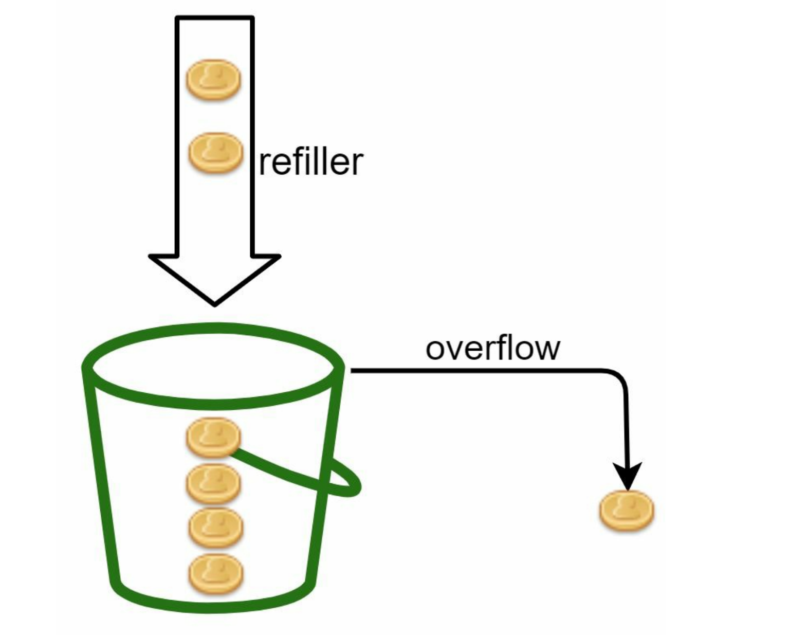
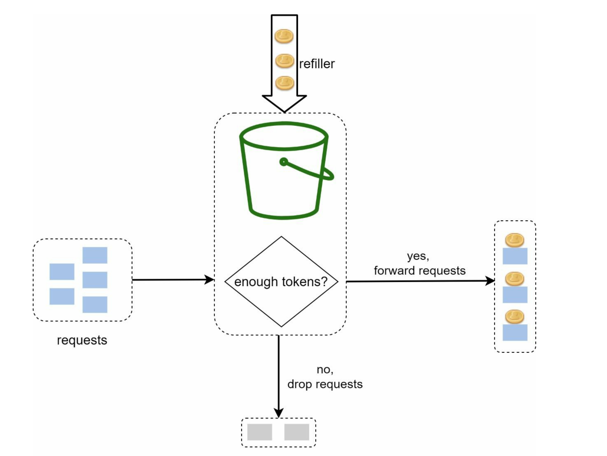
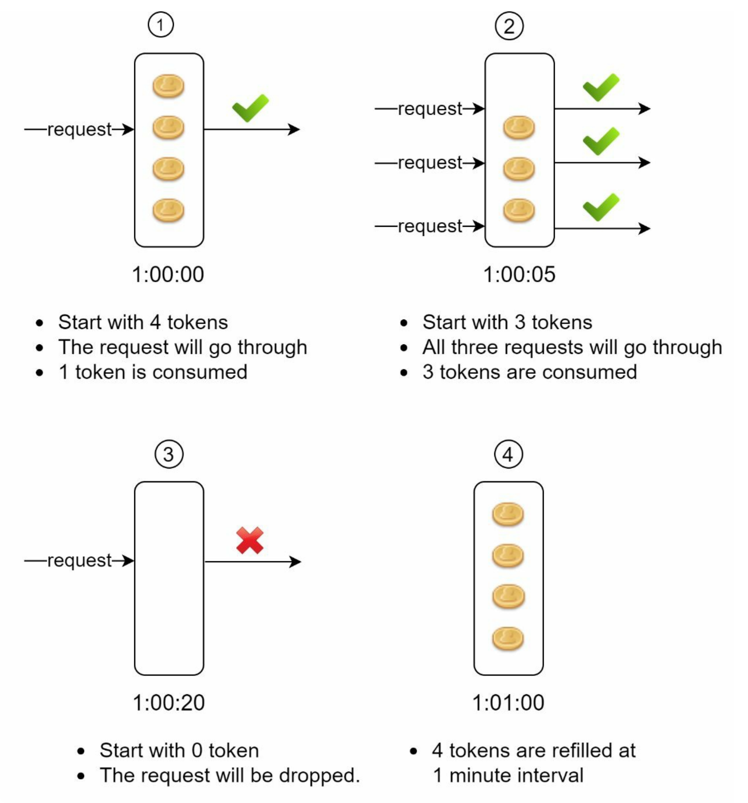

The token bucket algorithm is widely used for rate limiting. It is simple, well understood and commonly used by internet companies. Both Amazon and Stripe use this algorithm to throttle their API requests.

## 面试补充：简易令牌桶实现

令牌桶维护两个核心状态：

1. `capacity`：桶最大容量，决定允许的最大突发量。
2. `rate`：令牌生成速率，决定长期平均通过速率。

请求到达时先按距离上次刷新经过的时间补充令牌，再判断当前令牌数是否足够。令牌够则扣减并放行，不够则拒绝或等待。

下面是一个单机线程安全的 C++ 简化实现：

```cpp
#include <algorithm>
#include <chrono>
#include <mutex>

class TokenBucket {
public:
    TokenBucket(double capacity, double refill_per_second)
        : capacity_(capacity),
          tokens_(capacity),
          refill_per_second_(refill_per_second),
          last_(Clock::now()) {}

    bool allow(double cost = 1.0) {
        std::lock_guard<std::mutex> lock(mu_);
        refill();
        if (tokens_ < cost) {
            return false;
        }
        tokens_ -= cost;
        return true;
    }

private:
    using Clock = std::chrono::steady_clock;

    void refill() {
        auto now = Clock::now();
        std::chrono::duration<double> elapsed = now - last_;
        tokens_ = std::min(capacity_, tokens_ + elapsed.count() * refill_per_second_);
        last_ = now;
    }

    std::mutex mu_;
    double capacity_;
    double tokens_;
    double refill_per_second_;
    Clock::time_point last_;
};
```

实现要点：

1. 使用 `steady_clock`，不要用系统墙上时间，避免 NTP 调整导致令牌倒退或暴增。
2. 令牌可以用 `double` 表示，支持平滑补充；如果要求严格整数，可以用微秒级时间和整数缩放。
3. 多线程环境必须保护 `tokens` 和 `last`，否则并发请求可能同时看到足够令牌并超发。
4. 分布式限流不能只靠本地内存，通常用 Redis Lua、网关限流器或集中式限流服务保证原子性。

## 和漏桶、滑动窗口对比

| 算法 | 核心特性 | 优点 | 缺点 | 适合场景 |
| --- | --- | --- | --- | --- |
| 令牌桶 | 按速率生成令牌，请求消费令牌 | 允许短时突发，平均速率可控 | 参数调节不当会放过过大突刺 | API 网关、上传下载、秒杀入口削峰 |
| 漏桶 | 请求入队，按固定速率流出 | 输出平滑，保护下游稳定 | 不利于处理合理突发，队列满会丢弃新请求 | 下游处理能力固定的消费端 |
| 滑动窗口日志 | 记录窗口内每次请求时间 | 精确控制任意时间窗口 | 高 QPS 下内存成本高 | 账号登录、验证码、风控 |
| 滑动窗口计数器 | 当前窗口 + 上一窗口加权估算 | 内存少，比固定窗口平滑 | 近似算法，边界有误差 | 大流量接口限流 |

面试回答可以总结为：令牌桶限制长期平均速率，但通过桶容量允许短时突发；漏桶更强调固定速率输出；滑动窗口更适合控制任意连续时间内的请求数。入口网关常用令牌桶承接突发，下游保护或稳定消费更适合漏桶。

The token bucket algorithm work as follows:

+ A token bucket is a container that has pre-defined capacity. Tokens are put in the bucket at preset rates periodically. Once the bucket is full, no more tokens are added. As shown in Figure 1, the token bucket capacity is 4. The refiller puts 2 tokens into the bucket every second. Once the bucket is full, extra tokens will overflow.

  
																					**Figure 1**
	
+ Each request consumes one token. When a request arrives, we check if there are enough tokens in the bucket. Figure2 explains how it works.

  + If there are enough tokens, we take one token out for each request, and the request goes through.
  + If there are not enough tokens, the request is dropped.
  
  																					**Figure 2**

Figure 3 illustrates how token consumption, refill, and rate limiting logic work. In this example, the token bucket size is 4, and the refill rate is 4 per 1 minute.
  
  																					**Figure 3**

The token bucket algorithm takes two parameters:

+  Bucket size: the maximum number of tokens allowed in the bucket
+  Refill rate: number of tokens put into the bucket every second

How many buckets do we need? This varies, and it depends on the rate-limiting rules. Here are a few examples.

+ It is usually necessary to have different buckets for different API endpoints. For instance, if a user is allowed to make 1 post per second, add 150 friends per day, and like 5 posts per second, 3 buckets are required for each user.
+ If we need to throttle requests based on IP addresses, each IP address requires a bucket.
+ If the system allows a maximum of 10,000 requests per second, it makes sense to have a global bucket shared by all requests.

Pros:

+ The algorithm is easy to implement.
+ Memory efficient.
+ Token bucket allows a burst of traffic for short periods. A request can go through as long as there are tokens left.

Cons:

+ Two parameters in the algorithm are **bucket size** and **token refill rate**. However, it might be challenging to tune them properly.
+ 
