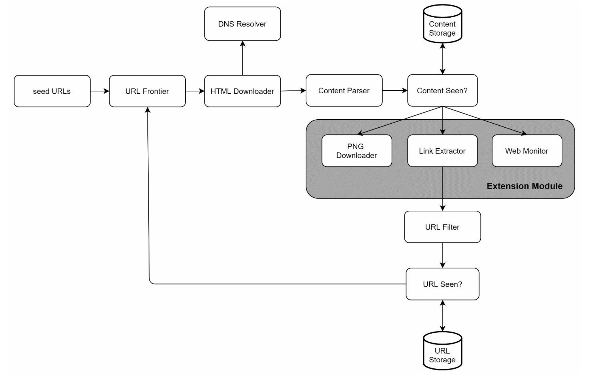

这张流程图展示了一个典型且模块化的**网络爬虫（Web Crawler）**或**蜘蛛（Spider）**的系统架构设计。

它不仅展示了基本的抓取流程，还引入了“扩展模块”的概念，使得系统具有处理特定任务（如图片下载或监控）的能力。

以下是对该架构的详细**解释**与**分析**：

------

### 1. 流程详解 (Step-by-Step Workflow)

我们可以将整个流程分为三个主要阶段：**调度与下载**、**内容处理**、**链接循环**。

#### **第一阶段：调度与下载 (Scheduling & Downloading)**

1. **seed URLs (种子 URL):** 这是爬虫的起点。系统通常需要由人工输入一批初始的链接。
2. **URL Frontier (URL 边界/调度器):** 这是爬虫的大脑。它负责管理待抓取的 URL 队列。它的职责通常包括：
   - **优先级排序：** 决定先抓取哪个网页。
   - **礼貌策略 (Politeness):** 避免对同一服务器发送过多请求。
3. **HTML Downloader (HTML 下载器):** 负责通过 HTTP/HTTPS 协议从互联网上获取网页内容。
4. **DNS Resolver (DNS 解析器):** 辅助下载器将域名解析为 IP 地址。由于 DNS 查询有延迟，通常会在这里设计缓存机制以提高速度。

#### **第二阶段：内容处理 (Processing & Storage)**

1. **Content Parser (内容解析器):** 下载下来的 HTML 只是原始文本，解析器会验证 HTML 格式，并将其转化为可操作的结构（如 DOM 树）。
2. **Content Seen? (内容去重校验):**
   - 这是一个关键步骤。它检查页面内容是否已经被存储过（例如通过计算页面内容的哈希值/指纹）。
   - 如果页面重复，则丢弃或仅更新元数据，避免浪费存储空间。
3. **Content Storage (内容存储):** 如果内容是新的，则将其存入数据库或文件系统。
4. **Extension Module (扩展模块 - 灰色区域):** 这是该架构的一个亮点，表明系统支持插件化处理：
   - **PNG Downloader:** 专门用于提取并下载页面中的图片资源。
   - **Link Extractor:** 负责从 HTML 中提取出所有的超链接（`<a>` 标签）。
   - **Web Monitor:** 可能用于监控网页的变化、更新频率或可用性状态。

#### **第三阶段：链接循环 (Feedback Loop)**

1. **URL Filter (URL 过滤器):** 接收从“Link Extractor”提取出的新链接，并过滤掉不需要的链接（例如：黑名单域名、非目标格式的文件、广告链接等）。
2. **URL Seen? (URL 去重校验):**
   - 检查这个 URL 是否以前已经被抓取过，或者是已经在待抓取队列中。
   - 技术上通常使用 **Bloom Filter (布隆过滤器)** 或哈希表来实现高效查找。
   - **URL Storage:** 这里存储所有访问过的 URL 历史记录。
3. **回环 (Loop Back):** 经过过滤和去重的新 URL 会被送回 **URL Frontier**，等待下一轮调度。

------

### 2. 架构分析 (Analysis)

#### **设计优点**

- **双重去重机制 (Double Deduplication):**
  - 图中有两个“Seen?”检查：一个针对**URL**，一个针对**Content（内容）**。
  - 这是一个非常健壮的设计。因为同一个内容可能有不同的 URL（例如 `example.com/p=1` 和 `example.com/post/1`）。如果只做 URL 去重，会导致存储大量重复内容；如果只做内容去重，会导致系统做大量无效的下载请求。两者结合效率最高。
- **模块化与扩展性 (Extension Module):**
  - 将特定的业务逻辑（如下载图片、监控）从主流程中剥离出来放入“Extension Module”。这意味着如果未来需要增加“PDF 下载”或“视频抓取”功能，只需在灰色区域增加一个模块，而无需修改核心的调度和下载逻辑。
- **职责分离 (Separation of Concerns):**
  - 下载（Downloader）、解析（Parser）和存储（Storage）各司其职。这有利于分布式部署。例如，可以部署 10 个下载器节点，但只用 1 个高配节点做解析。

#### **潜在挑战与优化点**

- **DNS 瓶颈:** 图中 DNS Resolver 是单点的。在大规模抓取中，DNS 解析往往是瓶颈，建议标明“DNS Cache”。
- **URL Frontier 的复杂性:** 图中是一个简单的方框，但实际上 URL Frontier 需要处理复杂的逻辑（如分布式队列、断点续传、防止爬虫陷阱）。
- **异步处理:** “Extension Module”里的任务（如下载 PNG）通常比提取文字慢得多。在实际工程中，这里通常需要引入**消息队列 (Message Queue)** 进行异步解耦，否则下载图片可能会阻塞链接提取的流程。