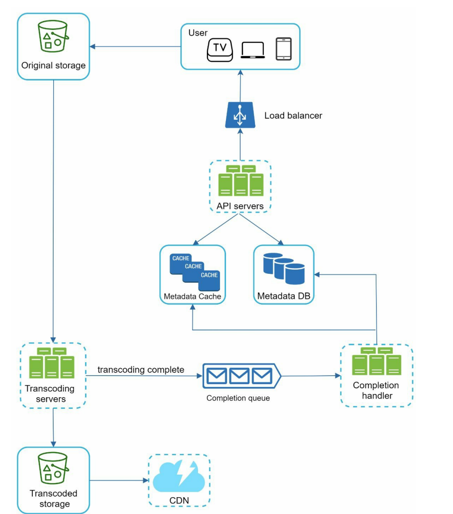

---

### 1. 流程深度拆解 (Step-by-Step Analysis)

我们可以把整个流程分为三个阶段：**上传阶段**、**处理阶段**、**完成阶段**。

#### 第一阶段：上传 (Upload Phase) —— 这里的关键是“分流”

图中展示了两条截然不同的路径：

1.  **元数据路径 (Metadata Path):** `User -> Load Balancer -> API Servers -> Metadata DB/Cache`
    *   **行为：** 用户填写视频标题、描述、分类等信息。
    *   **技术点：** 这些是文本数据，体积小。API Server (通常用 Go/Java/Node.js) 处理鉴权后，将其写入 DB (MySQL/PostgreSQL) 并更新 Cache (Redis)。此时视频状态标记为 `PROCESSING`。
    *   **代码视角：** 这是一个标准的 RESTful/gRPC 请求。

2.  **视频实体路径 (Binary Path):** `User -> Original Storage`
    *   **关键细节：** 注意箭头是**直接**指向存储的，没有经过 API Servers。
    *   **设计原理 (Pre-signed URL):** 这是一个巨大的优化点。视频文件动辄 1GB+，如果经过 API Server，会瞬间耗尽服务器的内存和带宽（IO Blocking）。
    *   **实现方式：**
        1.  User 请求 API Server：“我要传个文件”。
        2.  API Server 向对象存储（如 AWS S3）申请一个**预签名 URL (Pre-signed URL)**，有效期可能只有 30 分钟。
        3.  API Server 把这个 URL 给 User。
        4.  User 的客户端直接向这个 URL PUT 文件。
    *   **优势：** 流量不经过后端服务器，后端服务器只需处理轻量级逻辑，极大地节省了成本和扩展性。

#### 第二阶段：处理 (Processing Phase) —— 这里的关键是“异步与排队”

1.  **触发转码:** `Original Storage -> Transcoding Servers`
    *   **机制：** 当文件上传完成，存储系统（如 S3）会触发一个事件（Event Notification），或者 Transcoding Server 定时轮询（Polling，效率低，不推荐）。
    *   **任务：** 原始视频可能是 `.mov` 或 `.avi`，体积巨大且编码不适合网络传输。Transcoding Server 需要将其转换为自适应流格式（如 HLS 的 `.m3u8` + `.ts` 切片），并生成不同分辨率（1080p, 720p, 480p）。
    *   **底层技术 (C++/Rust):** 这里是 CPU 密集型操作。我们会使用 C++ 调用 FFmpeg 库，或者使用硬件加速（NVENC）。
    *   **架构缺失点：** 图中画的是直接连接。在工业级设计中，通常会在 Storage 和 Transcoding Servers 之间加一个 **消息队列 (Kafka/SQS)**。防止上传高峰期（如跨年夜）瞬间的大量任务把转码服务器压垮（削峰填谷）。

2.  **存储结果:** `Transcoding Servers -> Transcoded Storage -> CDN`
    *   **行为：** 转码后的切片文件存回对象存储。
    *   **CDN (Content Delivery Network):** 这些静态文件会被推送到全球边缘节点。用户播放时，是从最近的 CDN 节点拉取，而不是回源站，保证了低延迟。

#### 第三阶段：完成与回调 (Completion Phase) —— 这里的关键是“解耦”

1.  **完成队列:** `Transcoding Servers -> Completion Queue`
    *   **设计模式：** 生产者-消费者模型。
    *   **作用：** 转码服务只负责“转”，不负责“改状态”。转完后，它丢一条消息（Message）进队列：“Video ID 12345 is done”。这保证了转码服务的高吞吐，不用等待数据库写操作。

2.  **状态更新:** `Completion Queue -> Completion Handler -> Metadata DB/Cache`
    *   **Completion Handler (Worker):** 这是一个专门的微服务（通常用 Go 编写，高并发能力强）。它从队列里由消费消息。
    *   **操作：**
        1.  将 DB 中 Video ID 12345 的状态从 `PROCESSING` 改为 `ACTIVE` (可播放)。
        2.  **重要：** 必须处理 **Cache Invalidation (缓存失效)**。更新 DB 后，必须删除或更新 Redis 中的旧数据，否则用户看到的还是“处理中”。
        3.  可能还会触发通知服务（给用户发个 Push：“你的视频发布成功了”）。

---

### 2. 核心技术难点与面试加分项 (Deep Dive)

如果我是面试官，针对这张图，我会追问你以下几个问题，这也是你体现技术深度的地方：

#### A. 为什么需要 Completion Queue？可以直接写库吗？
**回答：**
虽然可以直接写库，但引入 Queue 实现了**系统解耦**和**流量控制**。
1.  **解耦：** 转码组（C++团队）不需要知道元数据组（Go/Java团队）的数据库 Schema，只需发个消息即可。
2.  **容错：** 如果 DB 挂了或正在维护，转码服务不会卡死，消息会堆积在 Queue 里，等 DB 恢复了再处理（最终一致性）。

#### B. 转码服务器如何并行化？(Parallelism)
图中画的是一个 `Transcoding Servers` 集群。
**深度回答：**
视频转码不能仅靠“文件级”并行（一个服务器处理一个视频）。对于一个 4K 的 2小时长电影，单机处理太慢。
我们需要做 **GOP (Group of Pictures) 切片并行**：
1.  **Split:** 将原始视频切成几百个小的 Chunk。
2.  **Map:** 将这些 Chunk 分发给几十台服务器同时转码。
3.  **Reduce:** 将转好的小片段合并成最终的流媒体文件。
这需要一个比图中更复杂的 DAG（有向无环图）任务调度系统。

#### C. 异常处理 (Error Handling)
如果转码失败了怎么办？
**设计：**
1.  **重试机制：** 队列应该支持重试（Retry）。
2.  **死信队列 (Dead Letter Queue - DLQ):** 如果重试 3 次还失败（可能是文件损坏或格式不支持），将消息移入 DLQ，并触发报警，由人工介入或给用户报错。

#### D. 安全性 (Security)
`User -> Original Storage` 这一步非常危险。
**防御：**
必须严格限制 Pre-signed URL 的权限：
1.  **Content-Type 限制：** 只允许视频格式。
2.  **大小限制：** 防止用户上传无限大的垃圾文件。
3.  **上传后扫描：** 转码前必须进行病毒扫描和文件头检查（防止将 `.exe` 改名为 `.mp4` 上传）。

### 3. 总结

这张图展示了一个**高可用、高并发、读写分离**的视频上传架构。

*   **Load Balancer & API:** 处理控制流。
*   **Direct Upload:** 解决大文件传输的 IO 瓶颈。
*   **Transcoding:** 解决多终端适配问题。
*   **Queue & Handler:** 解决系统耦合与状态同步问题。

在代码实现层面，这涉及到了 **Go (API/Handler)** 的高并发特性，**C++ (FFmpeg)** 的底层处理能力，以及 **Kafka/Redis/MySQL** 的协同工作。这是一套非常成熟的工业级解决方案。