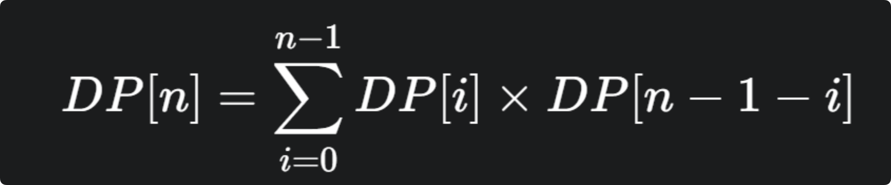

## n个元素，1-n依次入栈，出栈的顺序有多少种

使用动态规划（Dynamic Programming）求解这个问题有两种经典的方法。第一种是基于问题本身的递归结构，第二种是将其转换为网格路径计数问题。


### 基于递归结构的动态规划 (1D DP)

这种方法是卡特兰数最标准的 DP 推导方式。

**1. 定义状态 (DP State)**

我们定义 `DP[n]` 为：`n` 个元素（1 到 `n`）依次入栈，合法的出栈序列总数。

**2. 寻找状态转移（Recurrence Relation）**

我们来分析 `n` 个元素的情况。

- 元素 `1` 是第一个入栈的。
- 假设元素 `1` 是第 `k`个出栈的（`k` 的取值范围是 `1`到 `n`）。

这意味着什么呢？

- **在 $1$ 出栈之前**：
  - 元素 `2, 3, ..., k` 必须已经全部入栈，并且**全部出栈**了。
  - 为什么？因为 `1` 在栈底，要把它弹出来，它上面的所有元素都必须先出栈。
  - 这 `k-1` 个元素（`2, ..., k`）的入栈和出栈过程，本身就是一个独立的、规模为 `k-1` 的子问题。
  - 因此，这部分的合法出栈序列数是 `DP[k-1]`。
- **在 $1$ 出栈之后**：
  - 剩下的 `n-k` 个元素（`k+1, k+2, ..., n`）依次入栈，并全部出栈。
  - 这个过程与 `1 ... k` 完全无关，是一个独立的、规模为 `n-k` 的子问题。
  - 因此，这部分的合法出栈序列数是 `DP[n-k]`。

由于元素 `1` 可以在第 `1`个到第 `n` 个的任何一个位置出栈，我们将所有这些互斥的情况（不同的 `k` 值）相加，就得到了 `DP[n]`的总数。

为了方便，我们令 `i = k-1`（即 `1`出栈前有多少个元素出栈了）。`i`的取值范围是 `0` 到 `n-1`。

- 当 `i=0` 时（`1` 第一个出栈）：`DP[0] * DP[n-1]`
- 当 `i=1` 时（`1` 第二个出栈）：`DP[1] * DP[n-2]`
- ...
- 当 `i=n-1` 时（`1`最后一个出栈）：`DP[n-1] * DP[0]`

所以，状态转移方程为：



**3. 基础情况 (Base Case)**

`DP[0] = 1`。

这一定义至关重要。`n=0`（0 个元素）表示一个空序列，只有一种方法（什么都不做），所以 `DP[0]=1`。

**4. 求解**

我们可以从小到大计算 `DP`数组：

- `DP[0] = 1`
- `DP[1] = DP[0] * DP[0] = 1 * 1 = 1`
- `DP[2] = DP[0] * DP[1] + DP[1] * DP[0] = (1 * 1) + (1 * 1) = 2`
- `DP[3] = DP[0] * DP[2] + DP[1] * DP[1] + DP[2] * DP[0] = (1 * 2) + (1 * 1) + (2 * 1) = 5`
- `DP[4] = DP[0] * DP[3] + DP[1] * DP[2] + DP[2] * DP[1] + DP[3] * DP[0] = (1 * 5) + (1 * 2) + (2 * 1) + (5 * 1) = 14`

**伪代码：**

```
function solve(n):
  // DP[i] 存储 i 个元素时的出栈序列数
  DP = new array of size (n + 1)
  
  // 基础情况
  DP[0] = 1
  
  // 迭代计算 DP[1] 到 DP[n]
  for i from 1 to n:
    DP[i] = 0
    for j from 0 to (i - 1):
      DP[i] = DP[i] + DP[j] * DP[i - 1 - j]
      
  return DP[n]
```

时间复杂度：`O(n^2)`（两层循环）

空间复杂度：`O(n)`

