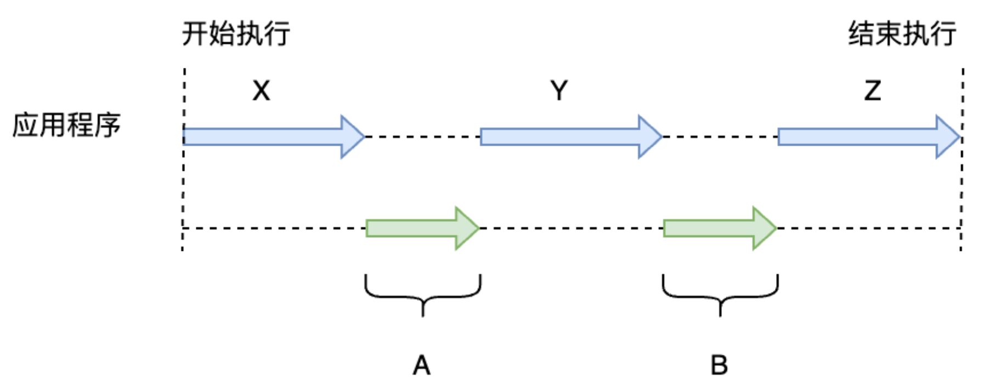

评价 GC 算法的性能时，我们采用以下 4 个标准。

吞吐量 • 最大暂停时间 • 堆使用效率 • 访问的局部性

### **吞吐量**

GC的吞吐量是：运行用户代码时间 / (运行用户代码时间 + 垃圾收集时间)。

如图2.5所示，在程序运行的整个过程中，应用程序的时间是X、Y、Z，应用程序的总时间是 X + Y + Z。GC一共启动了两次，花费的时间为A、B，则GC总花费的时间是 A + B。这种情况下 GC 的吞吐量为 (X + Y + Z) /(X + Y + Z + A + B)。

从这里的描述可知，GC的吞吐量就是应用程序执行的时间(不是内存大小哦)和GC时间的比值，GC执行的总时间越短，GC吞吐量越大。

人们通常都喜欢吞吐量高的 GC 算法。然而判断各算法吞吐量的好坏时不能一概而论。因为工程技术中，任何好处都是有代价的。

### 最大暂停时间

最大暂停时间指的是“因执行GC而暂停执行应用程序的最长时间”。

当编写像动作游戏这样追求即时性的程序时，就必须尽量压低 GC 导致的最大暂停时间。如果因为 GC 导致玩家频繁卡顿，相信谁都会想摔手柄。对音乐和动画这样类似于编码应用的程序来说，GC 的最大暂停时间就不那么重要了。更为重要的是，我们必须选择一个整体处理时间更短的算法。

不管尝试哪种 GC 算法，我们都会发现较大的吞吐量和较短的最大暂停时间不可兼得。所以应根据执行的应用所重视的指标的不同，来分别采用不同的 GC 算法。

### **堆使用效率**

堆使用效率，是指：程序在运行过程中，单位时间内能使用的堆内存空间的大小。举个例子，GC 复制算法中将堆二等分，每次只使用一半，交替进行，因此总是只能利用堆的一半。相对而言，GC 标记-清除算法和引用计数法就能利用整个堆。

与吞吐量和最大暂停时间一样，堆使用效率也是 GC 算法的重要评价指标之一。

然而，堆使用效率和吞吐量，以及最大暂停时间不可兼得。简单地说就是：可用的堆越大，GC 运行越快；相反，越想有效地利用有限的堆，GC 花费的时间就越长。

### **访问的局部性**

计算机上有 4 种存储器，分别是寄存器、缓存、内存、辅助存储器。

众所周知，越是可实现高速存取的存储器容量就越小。 计算机会尽可能地利用较高速的存储器，但由于高速的存储器容量小，不可能把所有要利用的数据都放在寄存器和高速缓存里。一般我们会把所有的数据都放在内存里，当 CPU 访问数据时，仅把要使用的数据从内存读取到缓存。由于数据是分块读取，我们还将它附近的所有数据都读取到高速缓存中， 从而压缩读取数据所需要的时间。这种内存空间中相邻的数据很可能存在连续访问因而带来访问效率提升的情况，称为“访问的局部性”。

部分GC算法会利用这种局部性原理，把具有引用关系的对象安排在堆中较近的位置，就能提高在缓存Cache中读取到想要的数据的概率，令应用程序高速运行。

