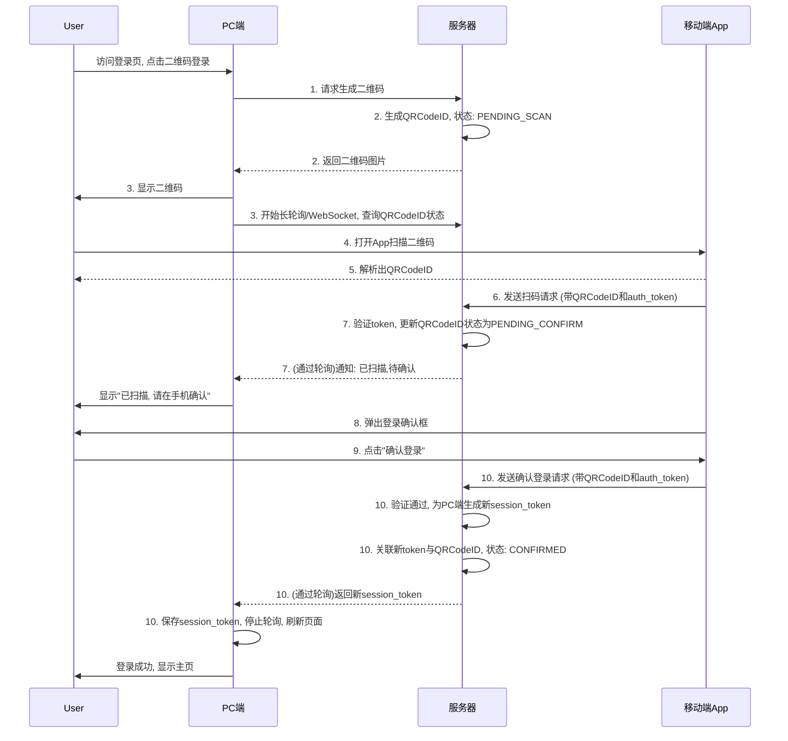

二维码登录（Scan-to-Login）是一个非常经典且巧妙的设计，它本质上是一种**跨设备认证授权**的机制。其核心思想是：**利用一台已经获得授信（已登录）的设备，为一台新的、未授信的设备进行安全授权，而无需在新设备上输入密码。**

我将从以下几个方面来详细拆解这个流程：

1.  **参与角色定义**
2.  **详细的交互流程（分步解析）**
3.  **流程时序图**
4.  **核心安全设计**
5.  **总结**

---

### 1. 参与角色定义

整个流程中主要有四个参与方：

*   **用户 (User)**：操作的发起者。
*   **待登录设备 (PC/Browser Client)**：用户希望登录的设备，例如PC浏览器。它当前是未认证状态。
*   **已授信设备 (Mobile App Client)**：用户已经登录并保持在线的设备，例如手机App。它持有有效的身份凭证（`auth_token`）。
*   **服务器 (Server)**：提供认证和授权服务的后端系统。

---

### 2. 详细的交互流程

整个流程可以分解为以下10个关键步骤：

**阶段一：PC端发起登录请求**

1.  **PC端请求二维码**：用户在PC浏览器上打开登录页面，并选择“二维码登录”。此时，浏览器会向服务器发起一个请求，意图是：“我是一台新设备，请给我一个用于登录的凭证。”

2.  **服务器生成并返回唯一二维码**：
    *   服务器收到请求后，生成一个**全局唯一、有时效性（例如60秒）的ID**，我们称之为 `QRCodeID` (通常是一个UUID)。
    *   服务器将这个 `QRCodeID` 作为**键(Key)**，在缓存（如Redis）中创建一个记录，并设置其初始状态为 `PENDING_SCAN`（待扫描），同时记录其过期时间。
    *   服务器将这个 `QRCodeID` 包装成一个特定的URL或字符串，并生成对应的二维码图片，返回给PC端。
    *   **关键点**：二维码本身不包含任何敏感信息，它仅仅是一个临时的、一次性的标识符。

3.  **PC端显示二维码并开始轮询**：
    *   浏览器接收到二维码图片并将其显示给用户。
    *   同时，浏览器开始以 `QRCodeID` 为参数，向服务器发起**长轮询 (Long Polling)** 或建立 **WebSocket** 连接。它会周期性地询问服务器：“`QRCodeID` 的状态是什么？”。这是为了让PC端能“实时”感知到后续的扫码和确认事件，而无需用户刷新页面。

**阶段二：移动端扫码并确认**

4.  **用户使用移动App扫描二维码**：用户打开手机App中的“扫一扫”功能，扫描PC屏幕上的二维码。

5.  **移动App解析二维码内容**：App解析出二维码中包含的 `QRCodeID`。

6.  **移动App发送“已扫描”确认给服务器**：
    *   App向服务器发送一个API请求，例如 `POST /api/scan`。
    *   这个请求中包含两个核心信息：
        *   **`QRCodeID`**：刚刚从二维码中解析出来的ID。
        *   **`auth_token`**：App自身登录时获取的、有效的用户身份令牌。
    *   这个请求的语义是：“我是已登录用户（由`auth_token`证明），我刚刚扫描了 `QRCodeID` 对应的这个二维码。”

7.  **服务器处理“已扫描”状态**：
    *   服务器验证 `auth_token` 的有效性，确认用户身份。
    *   服务器根据 `QRCodeID` 查找到缓存中的记录，将其状态从 `PENDING_SCAN` 更新为 `PENDING_CONFIRM`（待确认）。
    *   服务器通过PC端的长轮询或WebSocket连接，通知PC端：“这个二维码已经被扫了，请在手机上确认。” PC端收到通知后，可以在页面上显示“扫描成功，请在手机上确认登录”的提示。

8.  **移动App弹出确认界面**：为了安全，App在发送完“已扫描”请求后，会弹出一个确认界面，显示“是否确认在[XX设备]上登录？”等信息，让用户做二次确认。

9.  **用户在移动App上点击“确认登录”**：用户点击确认。

10. **移动App发送“最终确认”给服务器，完成授权闭环**：
    *   App再次向服务器发送一个API请求，例如 `POST /api/confirm_login`。
    *   这个请求同样携带 `QRCodeID` 和 `auth_token`。
    *   服务器收到这个最终确认后，执行登录授权的核心操作：
        *   验证 `auth_token`，查找 `QRCodeID`。
        *   为**PC端**生成一个新的、独立的 `session_token` 或 `cookie`。
        *   将这个新的 `session_token` 与 `QRCodeID` 关联起来，并将 `QRCodeID` 的状态更新为 `CONFIRMED`。
        *   最后，在下一次PC端的轮询请求中，服务器会将这个**新的 `session_token`** 返回给PC浏览器。
        *   PC浏览器拿到这个 `session_token` 后，将其保存到本地（如Cookie），停止轮询，并刷新页面或跳转到用户主页。至此，PC端登录成功。

---

### 3. 流程时序图（文字描述）

---

### 4. 核心安全设计

这个流程之所以安全，是因为它巧妙地规避了在不安全环境（PC端）输入敏感信息的风险。

1.  **凭证隔离**：用户的密码或长期有效的凭证从未在PC端出现或传输。整个授权过程依赖于已授信设备（手机）上的短期有效令牌（`auth_token`）。
2.  **二维码的瞬时性与唯一性**：二维码本身不携带敏感信息，只是一个一次性的“门票号”。它有很短的有效期，即使被截屏或拍照，一旦被扫描或过期就会失效，大大降低了被盗用的风险。
3.  **双重确认机制**：不仅需要“扫码”这个物理动作，还需要用户在手机上进行“确认登录”的逻辑操作，防止了因误扫、或在不知情的情况下被他人扫描（例如通过投影）而导致的意外登录。
4.  **安全信道**：所有客户端与服务器之间的通信都应在HTTPS加密信道下进行，防止中间人攻击窃取 `QRCodeID` 或 `token`。
5.  **明确的授权范围**：手机端确认时，通常会显示待登录设备的信息（如设备类型、IP地理位置等），让用户清楚地知道自己正在授权哪台设备。

### 5. 总结

总而言之，二维码登录的本质是**将认证（Authentication）和授权（Authorization）的过程进行分离**。

*   **认证**过程早已在安全的移动端完成。
*   **扫码**过程则是在PC端和移动端之间建立一个临时的、安全的连接通道。
*   **确认**过程则是移动端利用自己已认证的身份，对PC端的登录请求进行**授权**。

这是一个用户体验极佳且安全级别很高的解决方案，完美解决了跨设备登录场景下的安全与便捷性问题。